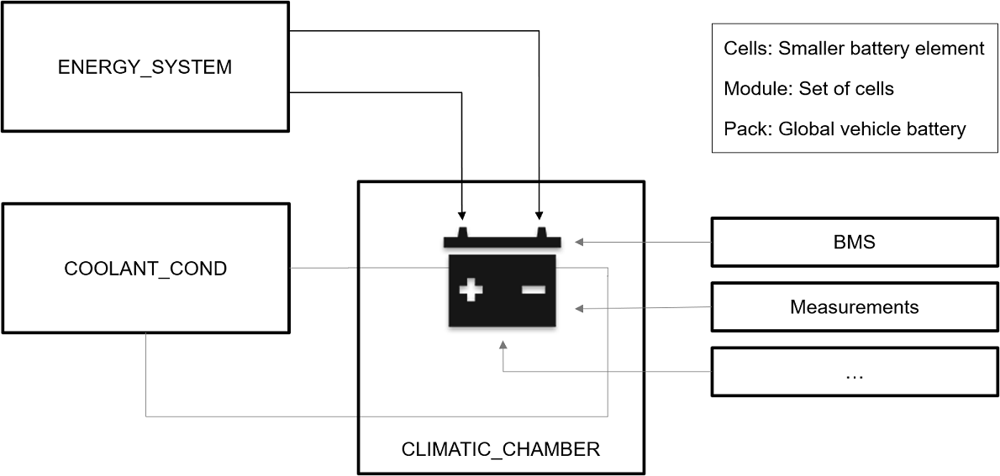
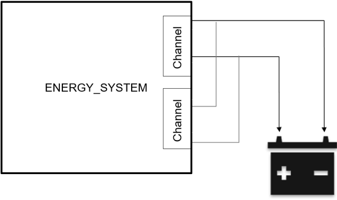
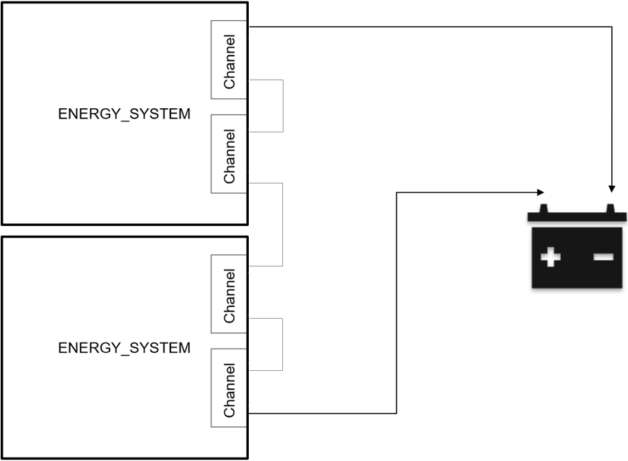
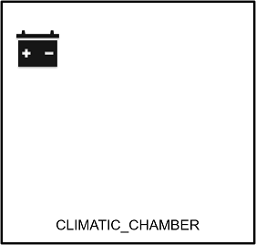
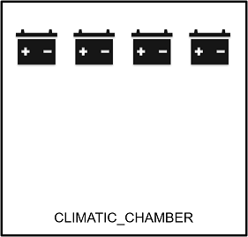
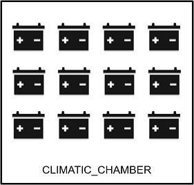

# General presentation

## Introduction

**SCALE Battery** has been developed to address all type of battery;
* Cell
* Module
* Pack

To meet the market demand, we are using the [MORPHEE® multi-instance](Multi-Instance.ipynb) concept.
This allows to start on the the same computer;
* Up to 32 cell tests in parallel
* Up to 16 Module tests in parallel
* Up to 8 Packs tests in parallel 

## Battery Testing principle

### Equipements and measure

To test a battery we need to have:
* **An Energy System** >> Allow to charge and discharge the battery. Generally it also manage the re-injection on the network.
* **A climatic chamber** - *optional* >> Allow to simulate environmental conditions
* **A coolant conditionning system** - *optional* >> use to cooldown the battery in same condition as in the vehicle.
* **A BMS** (**B**attery **M**angement **S**ystem) - *optional* >> Battery control unit handling the different cells/modules/pack and different modes (charge/sleep/Drive)
* ***Additionnal acquisition*** - *optional* >> Allow to add voltage, current and temperature measurement.



```{note}
Except Energy System, all others equipement can be 'Optional', depending on each application.
```

### Energy system channel concept

Energy System have one or several channel allowing to address one or several battery:
* If there is a need for more current, channels can we wired in parallel
* If there is a need for more voltage, channels can be wired in serial 

| Parallel connexion                 | Serial connexion                |
|:---------------------:|:------------------------:|
|  |   |

Regarding equipement capability, it is also possible to combine Energy system cascading and channel parallelisation or serialisation.

| Equipement and channel cascading  |
|:---------------------:|
|  |


### Modularity

Generally, in one climatic chamber there will be several battery in test. Climatic condition are identical but tests can be different!
 
| 1 battery                 | 4 batteries                | 12 batteries                |
|:---------------------:|:------------------------:|:------------------------:|
|  |   | |

```{important} The quantity of test is directly linked to the quantity of Energy System channels.
For example, if globaly a system has 8 channels, we can:
* Start 8 independant test using 1 channel each
* Start 4 independant test using 2 channel each (in // or serial)
* Start 2 independant test using 4 channel each (in // or serial)

Possibility is given, in one side from the hardware, and in the other side from the software configuration.
```

## Software architecture

Software architecture is based in one hand, on a master application managing most of the equipments (Energy, cooling, acquisition, climatic...), and on another hand several procedure executing the test(call instances). Communication between main application and procedure is developped the in [MORPHEE® multi-instance](Multi-Instance.ipynb) chapter.


Objective is to keep all instances as identical as possible. Only some interfaces can change;
* BMS
* Specif devices.

A specific configuration (hardware connexion) can also be done for every instance.. 

## Instances capability

We limit the quantities of instances to 1 master + 32 instances.
But more generally, the quantities will be limited by the configuration you will select:

| Ref                 | Description                                                        |
|---------------------|--------------------------------------------------------------------|
| **SA-M64-MULTI-04** |  Possibility to start **1** Master Instance + **4** test instances |
| **SA-M64-MULTI-08** |  Possibility to start **1** Master Instance + **8** test instances |
| **SA-M64-MULTI-16** | Possibility to start **1** Master Instance + **16** test instances |
| **SA-M64-MULTI-24** | Possibility to start **1** Master Instance + **24** test instances |
| **SA-M64-MULTI-32** | Possibility to start **1** Master Instance + **32** test instances |

## Instances limitation

Actual limitations are as follow:

| Ref                        | Master | Instances |
|----------------------------|--------|-----------|
| **Up to 1 + 8 instances**  |  1 kHz | 1 kHz     |
| **Up to 1 + 16 instances** | 500 Hz | 500 Hz    |
| **Up to 1 + 32 instances** | 100 Hz | 100 Hz    |

```{note}
This limitations has been achieved with FEV 8 cores computer.
```