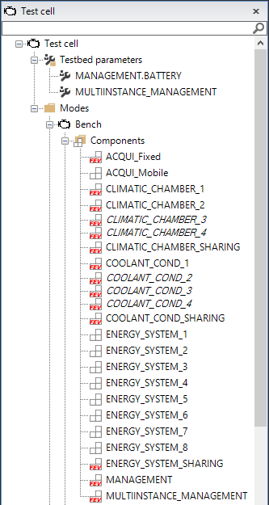

# Base configuration

```{important}
This documentation will not develop the hardware and feature configuration.
This has to be done previously.

Nevertheless, it will be possible to test all equipement one by one when it will be possible to start MORPHEE® master instance. 
```

## Principle

Concept of the SCALE Battery configuration is to use most of the equipement in the master instance and to give the possibility for each instance to attach to one (or more) equipement through 'Sharing' components;

````{div} full-width
```{image} ./images/Battery_Concept.png
```
````

The Sharing equipements take care of all present equipement of the familly;

ENERGY_SYSTEM_SHARING 
*   ENERGY_SYSTEM_1
*   ENERGY_SYSTEM_2
*   ...
*   ENERGY_SYSTEM_x

## Component role

### Definition

Component role are defined below:

````{div} full-width

| Component                      |       | Master  | Inst.  | Description                                                                                                                                                                                                                        |
|--------------------------------|:-----:|:---------:|:--------:|------------------------------------------------------------------------------------------------------------------------------------------------------------------------------------------------------------------------------------|
| **MANAGEMENT**                     | *SCALE* |    **X**    |    **X**   | Global management of all SCALE and non SCALE component in the configuration. Must be in all configuration                                                                                                                          |
| **CONTROL_MANAGEMENT.BATTERY**     | *SCALE* |         |    **X**   | Management of the different control mode for battery;                                                                                                                                                                              |
| **MEASUREMENT_MANAGEMENT.BATTERY** | *SCALE* |         |    **X**   | Management of acquisition for battery;                                                                                                                                                                                             |
| **MULTIINSTANCE_MANAGEMENT**       | *SCALE* |    **X**    |        | Handling of the configuration (see below) and instances                                                                                                                                                                            |
| **ACQUISITION**                   |       |    **X**    |   (**X**)  | Component for "normed name" customer channels. This is the main place to define: Link to hardware channel Securities Calculation Acquisition plan                                                                                  |
| **HARDWARE**                       |       |    **X**    |        | Component to place hardware channels of the configuration. Act as a simple passive component to concentrate acquisition channels.                                                                                                  |
| ***Customer specific component***   |       |    **X**    |   (**X**)  | All needed component for customer configuration, such as; PLC Barcode Various interface ...                                                                                                                                        |
| **BMS**                           | *SCALE* |         |    **X**   | Communication with the battery BMS, adressed either in CAN or FDX protocol. Frame given by SCALE architecture, but possibility to ADD new methods and channels if there is a need to add customer specific command (father method) |
| **DUT**                            | *SCALE* |         |    **X**   | DUT description. Frame given by SCALE architecture, but possibility to ADD new parameters if needed.                                                                                                                               |
| **ENERGY_SYSTEM_SHARING**          | *SCALE* | .MASTER | .SLAVE | Management of different ENERGY_SYSTEM; In link with the instance In regards to configuration                                                                                                                                       |
| **ENERGY_SYSTEM_X**                | *SCALE* |    **X**    |        | SCALE energy system devices                                                                                                                                                                                                        |
| **CLIMATIC_CHAMBER_SHARING**       | *SCALE* | .MASTER | .SLAVE | Management of different CLIMATIC_CHAMBER; In link with the instance In regards to configuration                                                                                                                                    |
| **CLIMATIC_CHAMBER_X**            | *SCALE* |    **X**    |        | SCALE climatic chamber devices                                                                                                                                                                                                     |
| **COOLAND_COND_SHARING**           | *SCALE* | .MASTER | .SLAVE | Management of different COOLAND_COND; In link with the instance In regards to configuration                                                                                                                                        |
| **COOLAND_COND_X**                 | *SCALE* |    **X**    |        | SCALE coolant conditionning devices                                                                                                                                                                                                |
| ***SCADA_CLIENT_MASTER***            | *SCALE* |    **X**    |        | Can be used only with SCADA                                                                                                                                                                                                        |
| ***SCADA_CLIENT_INSTANCE***          | *SCALE* |         |    **X**   | Can be used only with SCADA                                                                                                                                                                                                        |
|           |  |         |       |   |
````
### Configuration in UEditor

Here is an example of a standard Bench configuration;



```{hint}
To avoid re-design of the Dashboard, it makes sense to always use all equipement in the Bench configuration and make the link 'Optional' if they are not used;
```{image} ./images/UEditor_Link_Optionnal.png
:align: center
```
```

### MultiInstance configuration

Before starting, you need also to configure the MULTIINSTANCE_MANAGEMENT component:


By default, you can configure as follow;
| Parameter           | Description                  | Value      |
|---------------------|------------------------------|------------:|
| P_MIM.NB_INSTANCES  | Quantity of MORPHEE Instance | 8          |
| P_MIM.DATA_HANDLING |   Management of parameters   | By MORPHEE |
|  |      |  |


### Configuration without any hardware

Example of Configuration without any hardware and simulated components:

| Master configuration (In Bench cfg)    | 
|----------------------------------------|
| MANAGEMENT                             |
| MULTIINSTANCE_MANAGEMENT               |
| ENERGY_SYSTEM_SHARING.***MASTER***     |
| ENERGY_SYSTEM_1.SIMU_BASIC        |
| ENERGY_SYSTEM_2.SIMU_BASIC        |
| ENERGY_SYSTEM_3.SIMU_BASIC        |
| ENERGY_SYSTEM_4.SIMU_BASIC        |
| CLIMATIC_CHAMBER_SHARING.***MASTER***  |
| CLIMATIC_CHAMBER_1.SIMULATION     |
| CLIMATIC_CHAMBER_2.SIMULATION     |
| COOLANT_COND_SHARING.***MASTER***      |
| COOLANT_COND_1.SIMULATION         |
|  |

````{div} full-width

| Master configuration (In Bench cfg)    | Instance 1 configuration (In Test cfg) | Instance n configuration (In Test cfg) |
|----------------------------------------|----------------------------------------|----------------------------------------|
| MANAGEMENT                             |               MANAGEMENT               |               MANAGEMENT               |
| MULTIINSTANCE_MANAGEMENT               |           CONTROL_MANAGEMENT.BATTERY           |           CONTROL_MANAGEMENT.BATTERY           |
| ENERGY_SYSTEM_SHARING.***MASTER***     |    ENERGY_SYSTEM_SHARING.***SLAVE***   |    ENERGY_SYSTEM_SHARING.***SLAVE***   |
| ENERGY_SYSTEM_1.SIMU_BASIC        |                                        |                                        |
| ENERGY_SYSTEM_2.SIMU_BASIC        |                                        |                                        |
| ENERGY_SYSTEM_3.SIMU_BASIC        |                                        |                                        |
| ENERGY_SYSTEM_4.SIMU_BASIC        |                                        |                                        |
| CLIMATIC_CHAMBER_SHARING.***MASTER***  | CLIMATIC_CHAMBER_SHARING.***SLAVE***   | CLIMATIC_CHAMBER_SHARING.***MASTER***  |
| CLIMATIC_CHAMBER_1.SIMULATION     |                                        |                                        |
| CLIMATIC_CHAMBER_2.SIMULATION     |                                        |                                        |
| COOLANT_COND_SHARING.***MASTER***      | COOLANT_COND_SHARING.***SLAVE***       | COOLANT_COND_SHARING.***SLAVE***       |
| COOLANT_COND_1.SIMULATION         |                                        |                                        |
|  |   |  |
````
```{note}
All component existing in your configuration but not present in this table can be put as 'Optional' 
```

### Configuration with hardware

The configuration with hardware is not so different. You just have to replace 'Simulated' equipments with real one, and add your own component if needed (Acquisition, Hardware, etc...).

The table below is not exhaustive but show the configuration concept by using hardware:

| Master configuration (In Bench cfg)    | 
|----------------------------------------|
| MANAGEMENT                             |
| MULTIINSTANCE_MANAGEMENT               |
| ENERGY_SYSTEM_SHARING.***MASTER***     |
| ENERGY_SYSTEM_1.*Real device*        |
| ENERGY_SYSTEM_2.*Real device*        |
| ENERGY_SYSTEM_3.*Real device*        |
| ENERGY_SYSTEM_4.*Real device*        |
| CLIMATIC_CHAMBER_SHARING.***MASTER***  |
| CLIMATIC_CHAMBER_1.*Real device*     |
| CLIMATIC_CHAMBER_2.*Real device*     |
| COOLANT_COND_SHARING.***MASTER***      |
| COOLANT_COND_1.*Real device*         |
|   |


## First start

```{hint}
We recommend, for the first start, to use the simulated components and to limit the number of instances. 
```
When you have reach this point, you are ready to start SCALE Battery master instance.

You should see:


