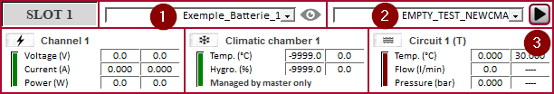
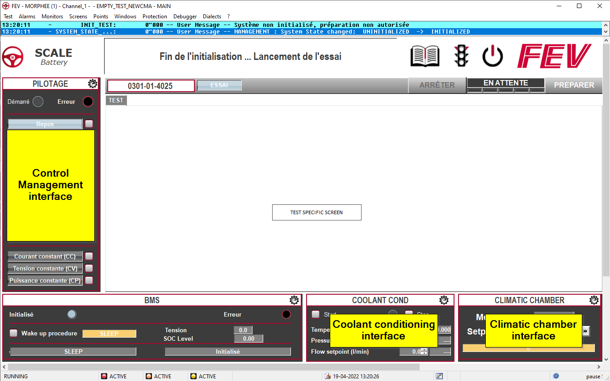
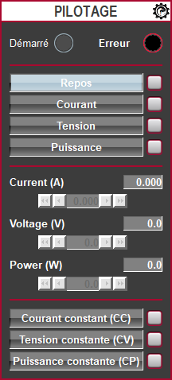
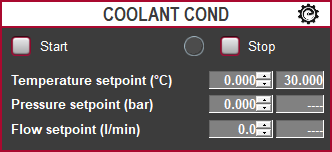
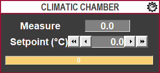
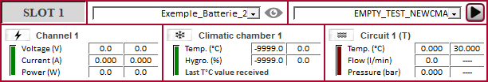

# Starting an Instance

## The first start

When your configuration is complete, you are ready to start your first instance. By default, you should see some battery description and at least one basic test (EMPTY_TEST_NEWCMA):



1. Select a battery definition
2. Select the test: EMPTY_TEST
3. Push the 'PLAY BUTTON'

This should result in:


- In the top left, you should see the instance number
- On main screen:
    - The control Management interface
    - The coolant conditioning interface
    - The climatic chamber interface

## Testing the functionnalities

### The Control Management

Once the instance started, you should **PREPARE** the different component. For this, push the **PREPARE** button on the top right.

When prepared, you are ready to send commands to the related **ENERGY_SYSTEM**

```{div} full-width
```{note} **Control Management** 
````{panels}

---
- States:
    - **Rest**: Battery is in Idle mode
    - **Current**: Battery is in Current mode
    - **Volatge**: Battery is in Voltage mode
    - **Power**: Battery is in Power mode
    - *Each button will select the related mode*
- When the mode is set:
    - Setpoint can be send through S_CMA.**f**_SET (where **f** is either I, V or P)
    - Measurement are read in R_CMA.**f**_ACT (where **f** is either I, V or P)
- Integrated function:
    - SET_CC: Integrated command to send current setpoint with voltage and duration limit.
    - SET_CV: Integrated command to send voltage setpoint with current and duration limit.
    - SET_CP: Integrated command to send power setpoint with voltage and duration limit.
````
```

### The coolant conditioning

```{note} **Coolant conditionning** 
````{panels}

---
- Start the conditioning
    - When started, different setpoint are take into account
- Stop the conditioning
````


### The climatic chamber

```{note} **Climatic Chamber** 
````{panels}

---
- Measurement
- Set point
- Status
````

```{important}
In the master instance, on every slot, you can see the setpoint arriving from the instance and the measurement going back;

```
