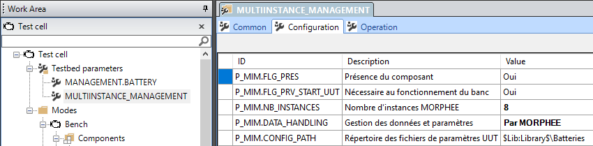
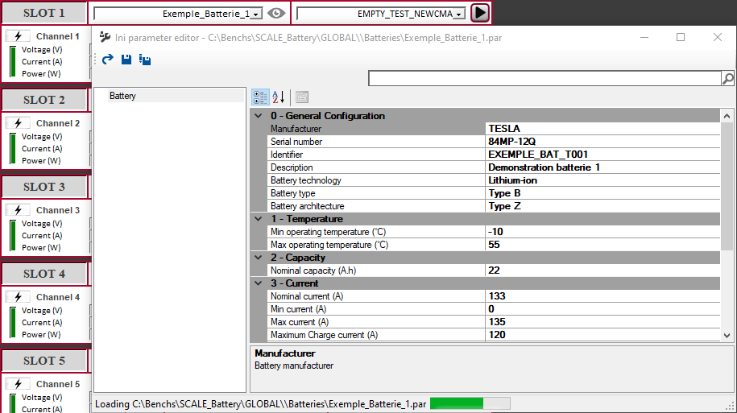

# Interfacing through file

When you have only **MORPHEE®** and no centralization software, **FlexLab®** for instance,  you need to parametrize your test by pushing it some parameters.
This can be done through `files`.


## Activate the data handling through MORPHEE®

To activate the data handling through MORPHEE®, you need to configure the MULTIINSTANCE_MANAGEMENT component:



And select;
| Parameter           | Description                  | Value      |
|---------------------|------------------------------|------------:|
| P_MIM.DATA_HANDLING |   Management of parameters   | By MORPHEE |
| P_MIM.CONFIG_PATH |   Path of UUT configuration files   | `$Lib:Library$\Batteries` |
|  |      |  |

If you select this configuration, on every slot, a drop-down list will appear with all existing configuration in the directory `$Lib:Library$\Batteries` (library defined as `Library` in **MENV** + `\Batteries` subdirectory);


## Create, Display and Edit configuration

By pushing the small icon near the dropdown list will display a `Viewer`:
 


This one allow you to:
- Modify some values and save
- Save As and generate a new file in the dropdown list

Once modified/Create, all values will be passed to **MORPHEE®** as parameters when starting a test.

## Modifying the configuration

As seen before, configuration and parameters files are in the `$Lib:Library$\Batteries` folder. You will find one `IniEditor.config` for the display configuration and several `.par` files for parameters.

You can customize the global display and fields you will get in the `.par` files by modifying the `IniEditor.config` file. 

### Display modification

Display can be customized by an XML file:
- `<Group>` : Name of the group of display
- `<Category>` : Subgroup of a display
- `<Property>` : Parameter including:
    - `Section` in the param file (eg; `[DB]`)
    - `Field` = name of the **MORPHEE®** parameter (eg: `P_DUT.MANUFACTURER`)
    - `Type` =  Type of input data between "String", "NotEmptyString", "Int[0,3]", "Int[-100,100]", etc...
    - `DisplayName` : Name to display
    - `Description` : Description of the parameter
    - `DefaultValue` : Default value of the parameter

Example of `IniEditor.config` file:
````{div} full-width
```{code-block} html
<?xml version="1.0" encoding="utf-8" ?>
<ConfigDesc>
	<Group Id="Battery">
		<Category Id="0 - General Configuration">
			<Property Section="DB" Field="P_DUT.MANUFACTURER" Type="NotEmptyString" DisplayName="Manufacturer" Description="Battery manufacturer" />
			<Property Section="DB" Field="P_DUT.SERIAL_NUMBER" Type="NotEmptyString" DisplayName="Serial number" Description="Battery serial number"/>
			<Property Section="DB" Field="P_DUT.IDENTIFIER" Type="NotEmptyString" DisplayName="Identifier" Description="Unique identifier"/>
			<Property Section="DB" Field="P_DUT.DESCRIPTION" Type="String" DisplayName="Description" Description="Free description field"/>
			<Property Section="DB" Field="P_DUT.TECHNOLOGY"  Type="Int[0,3]" DisplayName="Battery technology" Description="Battery technology" DefaultValue="1">
				<TypeConverter Localizable="false">
					<Value Value="0" DisplayValue="Lithium-ion" />
					<Value Value="1" DisplayValue="Lithium-sulphur" />
					<Value Value="2" DisplayValue="Aluminium-air" />
				</TypeConverter>
			</Property>
			<Property Section="DB" Field="P_DUT.TYPE"  Type="Int[0,2]" DisplayName="Battery type" Description="Battery type (A, B or C)" DefaultValue="1">
				<TypeConverter Localizable="false">
					<Value Value="0" DisplayValue="Type A" />
					<Value Value="1" DisplayValue="Type B" />
					<Value Value="2" DisplayValue="Type C" />
				</TypeConverter>
			</Property>
			<Property Section="DB" Field="P_DUT.ARCHITECTURE"  Type="Int[0,2]" DisplayName="Battery architecture" Description="Battery architecture (X, Y or Z)" DefaultValue="0">
				<TypeConverter Localizable="false">
					<Value Value="0" DisplayValue="Type X" />
					<Value Value="1" DisplayValue="Type Y" />
					<Value Value="2" DisplayValue="Type Z" />
				</TypeConverter>
			</Property>
		</Category>
		<Category Id="1 - Temperature">
			<Property Section="DB" Field="P_DUT.OPERATING_TEMP_MIN" Type="Int[-100,100]" DisplayName="Min operating temperature (°C)" Description="Minimum temperature" />
			<Property Section="DB" Field="P_DUT.OPERATING_TEMP_MAX" Type="Int[-100,100]" DisplayName="Max operating temperature (°C)" Description="Maximum temperature"/>
		</Category>
		<Category Id="2 - Capacity">
			<Property Section="DB" Field="P_DUT.CAPACITY_NOM" Type="Int[0,2000]" DisplayName="Nominal capacity (A.h)" Description="Battery capacity" />
		</Category>
		<Category Id="3 - Current">
			<Property Section="DB" Field="P_DUT.CURRENT_NOM" Type="Int[0,1000]" DisplayName="Nominal current (A)" Description="Battery nominal current" />
			<Property Section="DB" Field="P_DUT.CURRENT_MIN" Type="Int[0,1000]" DisplayName="Min current (A)" Description="Battery minimum current" />
			<Property Section="DB" Field="P_DUT.CURRENT_MAX" Type="Int[0,1000]" DisplayName="Max current (A)" Description="Battery maximum current" />
			<Property Section="DB" Field="P_DUT.CURRENT_CHARGE_MAX" Type="Int[0,1000]" DisplayName="Maximum Charge current (A)" Description="Maximum charge current" />
			<Property Section="DB" Field="P_DUT.CURRENT_DISCHARGE_MAX" Type="Int[-1000,0]" DisplayName="Maximum discharge current (A)" Description="Maximum discharge current" />
		</Category>
		<Category Id="4 - Voltage">
			<Property Section="DB" Field="P_DUT.VOLTAGE_NOM" Type="Int[0,1000]" DisplayName="Nominal voltage (V)" Description="Battery nominal voltage" />
			<Property Section="DB" Field="P_DUT.VOLTAGE_MIN" Type="Int[0,1000]" DisplayName="Min voltage (V)" Description="Battery minimum voltage" />
			<Property Section="DB" Field="P_DUT.VOLTAGE_MAX" Type="Int[0,1000]" DisplayName="Max voltage (V)" Description="Battery maximum voltage" />
			<Property Section="DB" Field="P_DUT.VOLTAGE_CHARGE_MAX" Type="Int[0,1000]" DisplayName="Maximum Charge voltage (V)" Description="Maximum charge voltage" />
			<Property Section="DB" Field="P_DUT.VOLTAGE_DISCHARGE_MAX" Type="Int[0,1000]" DisplayName="Maximum discharge voltage (V)" Description="Maximum discharge voltage" />
		</Category>
		<Category Id="5 - Power">
			<Property Section="DB" Field="P_DUT.POWER_NOM" Type="Int[0,1000]" DisplayName="Nominal power (kW)" Description="Battery nominal power" />
			<Property Section="DB" Field="P_DUT.POWER_MIN" Type="Int[0,1000]" DisplayName="Min power (kW)" Description="Battery minimum power" />
			<Property Section="DB" Field="P_DUT.POWER_MAX" Type="Int[0,1000]" DisplayName="Max power (kW)" Description="Battery maximum power" />
		</Category>
	</Group>
</ConfigDesc>
```
````

### Exemple of parameters file

Exemple of parameters generated by actual configuration:
```{code-block} python
[DB]
P_DUT.MANUFACTURER=TESLA
P_DUT.SERIAL_NUMBER=84MP-12Q
P_DUT.CAPACITY_NOM=22
P_DUT.CURRENT_NOM=133
P_DUT.CURRENT_MIN=0
P_DUT.CURRENT_MAX=135
P_DUT.CURRENT_CHARGE_MAX=120
P_DUT.CURRENT_DISCHARGE_MAX=-122
P_DUT.POWER_NOM=130
P_DUT.POWER_MIN=0
P_DUT.POWER_MAX=135
P_DUT.VOLTAGE_NOM=180
P_DUT.VOLTAGE_MAX=200
P_DUT.VOLTAGE_MIN=80
P_DUT.VOLTAGE_CHARGE_MAX=175
P_DUT.VOLTAGE_DISCHARGE_MAX=100
P_DUT.TYPE=1
P_DUT.ARCHITECTURE=2
P_DUT.TECHNOLOGY=0
P_DUT.DESCRIPTION=Demonstration batterie 1
P_DUT.OPERATING_TEMP_MIN=-10
P_DUT.OPERATING_TEMP_MAX=55
P_DUT.IDENTIFIER=EXEMPLE_BAT_T001
```


